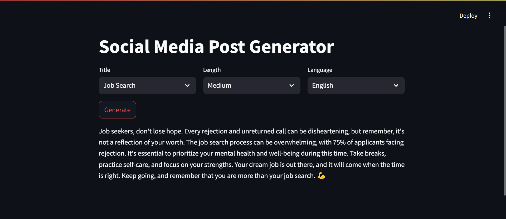

# GenAI Social Media Post Generator

This tool will analyze posts of a Social Media influencer and help them create the new posts based on the writing style in their old posts



Let's say X person is a Social Media influencer and he needs help in writing his future posts. He can feed his past Social Media posts to this tool and it will extract key topics. Then he can select the topic, length, language etc. and use Generate button to create a new post that will match his writing style.

## Technical Architecture


1. Stage 1: Collect Social Media posts and extract Topic, Language, Length etc. from it.
1. Stage 2: Now use topic, language and length to generate a new post. Some of the past posts related to that specific topic, language and length will be used for few shot learning to guide the LLM about the writing style etc.

## Set-up

1. To get started we first need to get an API_KEY from here: https://console.groq.com/keys. Inside `.env` update the value of `GROQ_API_KEY` with the API_KEY you created.
2. To get started, first install the dependencies using:
   ```commandline
    pip install -r requirements.txt
   ```
3. Run the streamlit app:
   ```commandline
   streamlit run main.py
   ```
   Copyright (C) Kumartusha Inc. All rights reserved.

**Additional Terms:**
This software is licensed under the MIT License. However, commercial use of this software is strictly prohibited without prior written permission from the author. Attribution must be given in all copies or substantial portions of the software.
